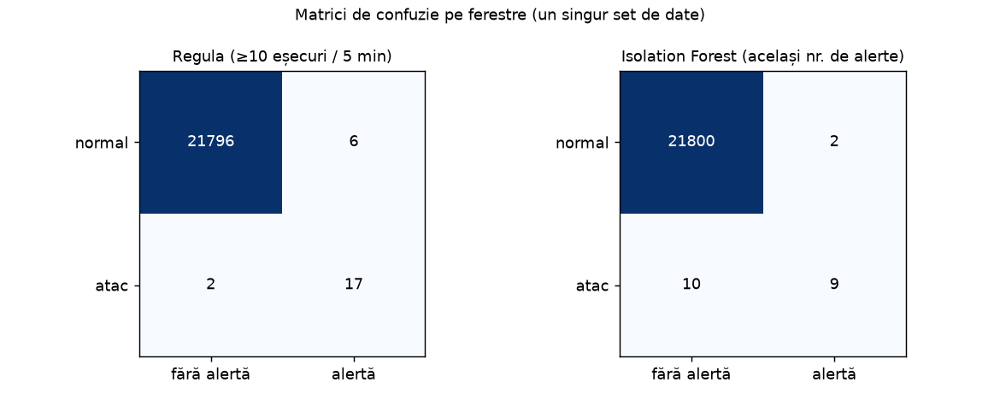

# Detecția atacurilor brute-force din loguri Windows (Event ID 4625)

Proiect mic de securitate defensivă cu **Python, Pandas și scikit-learn**: comparăm o *regulă simplă de SIEM*
(„cel puțin 10 autentificări eșuate în 5 minute") cu un model de învățare automată *nesupervizat*
(Isolation Forest) pe loguri de autentificare Windows.

> **Datele sunt sintetice.** Toate logurile sunt generate de cod (adrese IP din intervalele rezervate pentru
> documentație, utilizatori inventați). Nu există date reale. Rezultatele **nu** se pot generaliza la un mediu real.

## Ce face proiectul

1. **Generează loguri** Windows sintetice: trafic normal (4624 = login reușit, 4625 = login eșuat) și
   - *brute-force*: o adresă încearcă multe parole pentru un singur utilizator;
   - *password spraying*: o adresă încearcă puține parole pentru mulți utilizatori;
   - două situații legitime care **arată** ca un atac: un utilizator care își blochează contul și un serviciu configurat greșit.
2. **Construiește „ferestre"**: câte o linie pentru fiecare adresă IP și interval de 5 minute, cu caracteristici precum
   numărul de eșecuri, câți utilizatori diferiți au eșuat, câte calculatoare au fost țintite.
3. **Compară metodele** cu precizie, recall și F1, pe mai multe seturi de date generate cu seed-uri diferite.

## Rezultate (medie ± abatere standard pe 5 seturi de date)

| Metodă | Precizie | Recall | F1 | Alerte / set | Alerte false / set |
|---|---|---|---|---|---|
| Regula (≥10 eșecuri / 5 min) | 0,72 ± 0,03 | 0,78 ± 0,13 | 0,75 ± 0,07 | 22,2 | 6,2 |
| Isolation Forest, 0,5% din ferestre | 0,23 ± 0,03 | 0,97 ± 0,02 | 0,37 ± 0,04 | 88,0 | 68,0 |
| Isolation Forest, **același număr de alerte** ca regula | 0,63 ± 0,11 | 0,43 ± 0,14 | 0,50 ± 0,12 | 14,4 | 5,4 |

Un set are aproximativ 27.000 de evenimente, 22.000 de ferestre și ~20 de ferestre de atac (dezechilibru puternic).
Rezultatele se reproduc cu `python -m detectie_bruteforce.run_experiment --n-seeds 5`
(testat cu Python 3.12 și scikit-learn 1.6.1).



### Cum se citesc

* **Regula simplă este greu de învins** când atacul lasă o semnătură clară. La același număr de alerte, Isolation Forest
  prinde mai puține atacuri decât regula.
* **Isolation Forest poate prinde tot** (recall 0,97), dar doar dacă îl lăsăm să semnaleze mult mai multe ferestre,
  iar atunci majoritatea alertelor sunt false. În practică asta înseamnă oboseală de alerte pentru un analist.
* Pe setul din notebook, tiparele de *password spraying* (mulți utilizatori încercați de la o adresă) sunt prinse de model
  mai ușor decât brute-force-ul cu un singur utilizator, iar regula ratează unele ferestre de spraying cu puține eșecuri.
* Concluzia onestă: o regulă bună rămâne un punct de plecare puternic; un model poate completa regula, nu o înlocuiește.

## Cum îl rulezi

Cerințe: Python 3.10+ (recomandat 3.12).

**Windows (cel mai simplu):** dublu-click pe `run_windows.bat`. Creează un mediu virtual, instalează pachetele
și rulează experimentul.

**Manual (orice sistem):**

```bash
python -m venv .venv
# Windows: .venv\Scripts\activate      Linux/macOS: source .venv/bin/activate
pip install -r requirements.txt
python -m detectie_bruteforce.run_experiment --n-seeds 5
```

Teste automate și notebook:

```bash
pip install -r requirements-dev.txt
python -m pytest -q
jupyter lab notebooks/analiza.ipynb   # sau deschide notebook-ul direct pe GitHub
```

## Structura

```
detectie_bruteforce/
  generate_data.py    generatorul de loguri sintetice
  features.py         transformarea în ferestre de 5 minute + caracteristici
  models.py           regula simplă, Isolation Forest, evaluarea
  run_experiment.py   rulează totul și salvează rezultatele în results/
notebooks/analiza.ipynb   analiza pas cu pas, cu grafice
tests/                    teste automate (pytest)
results/                  metrici (metrics.json) și grafic
```

## Limite

* Date sintetice, construite de mine împreună cu Claude: un mediu real are alt zgomot și alte tipuri de atac.
* Un singur tip de model (Isolation Forest), cu parametri implicit-rezonabili, fără optimizare.
* Evaluare pe ferestre, nu pe incidente; nu se măsoară timpul până la detecție.
* Nu este pregătit pentru producție și nu înlocuiește un SIEM.

## Realizat cu ajutorul AI

Am realizat acest proiect împreună cu **Claude** (asistent AI de la Anthropic). Eu am ales tema, am stabilit direcția
și am verificat rezultatele. Claude a scris codul, testele și acest README. Nu pretind că am scris codul singur.

## Licență

MIT, vezi [LICENSE](LICENSE). Autor: **VibeStorm**.
